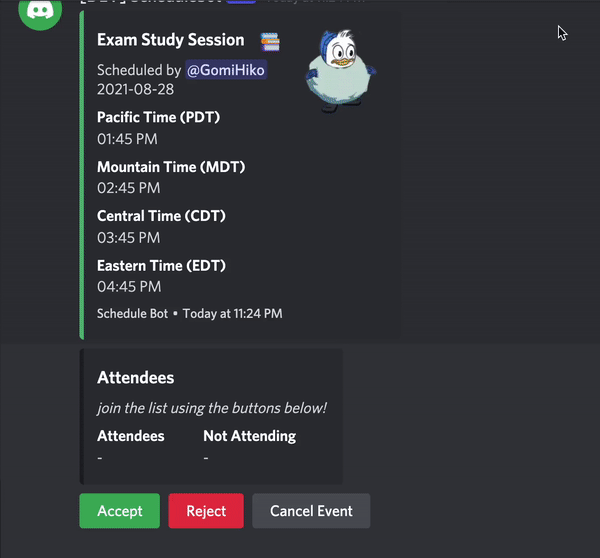

# Schedulebot
Schedulebot is a simple Discord bot using [discord.py](https://github.com/Rapptz/discord.py) created to help manage scheduled events in your Discord server. It makes it easy to schedule an event and confirm your attendance or absence.

## Running
You should just be able to clone the repository and run the `bot.py` file directly or using poetry. The bot will generate a `config.ini` file after the first run, populate it with your bot's secret token and your desired command prefix and run the bot again to get started!

### Heroku
A sample `Procfile` and `requirements.txt` are provided for hosting this bot on [Heroku](https://heroku.com). To deploy to Heroku, fork this repository and deploy it to a new Dyno. Instead of using a `config.ini` file like you would if you were running the bot locally, create `token` and `prefix` environment variables and populate them with their respective values.

## Planned Features

 - Improved perfomance
 - Refactorings to increase readability
 - Improved comments and documentation
 - Bot should include a help embed
 - Improve date parsing to increase flexibility
 - Events should no longer be joinable after they have begun
 - Events should not be able to be planned for the past
 - Anyone attending an event should be notified via mention
 - Bot should have an avatar on Discord
